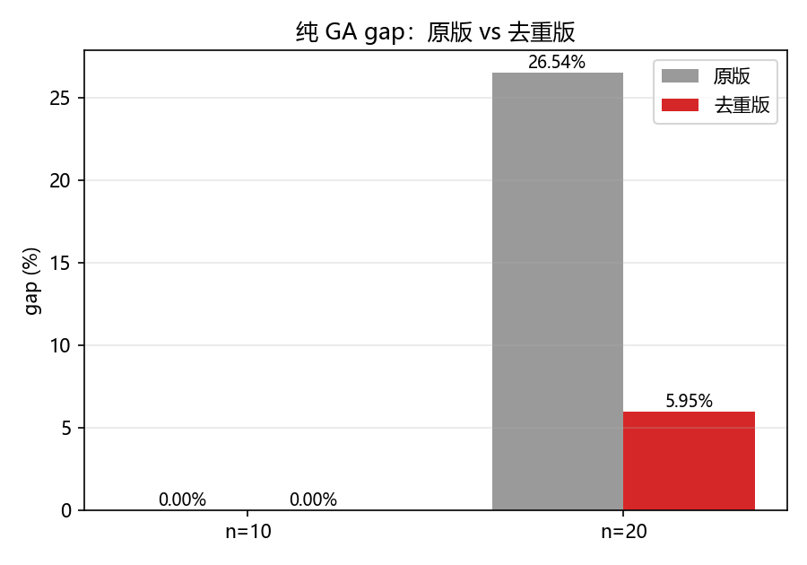
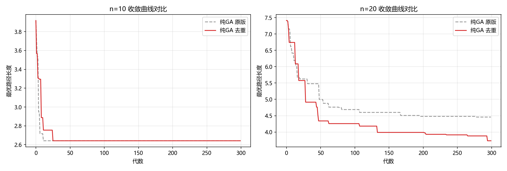
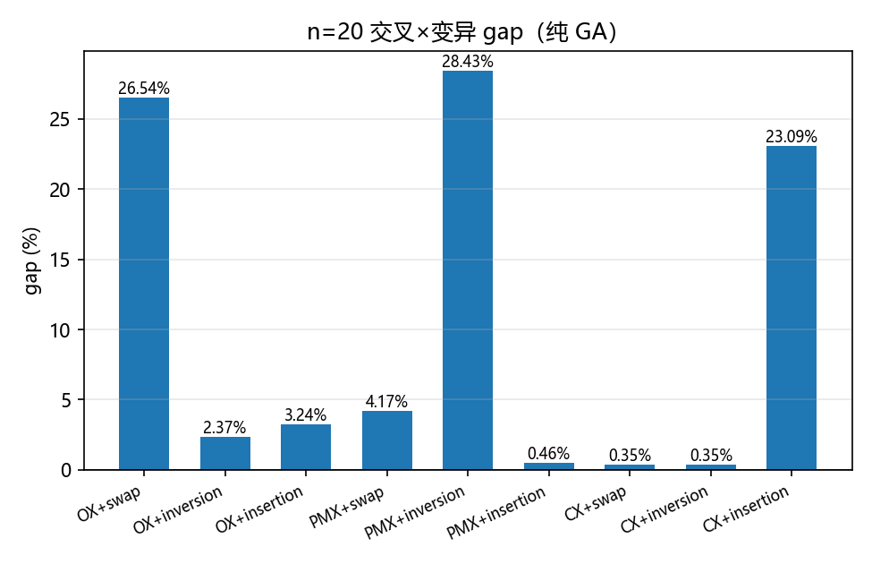
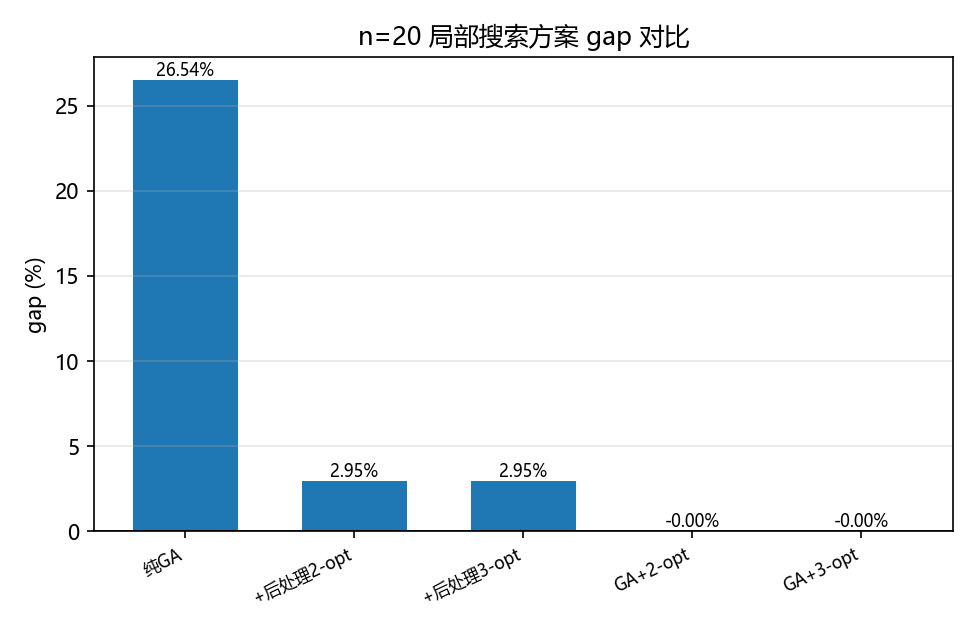

# GA-TSP-Visualizer

## 通过这个练习我学了什么

1. NP,NP-hard,NP-complete是什么。
2. TSP的优化版本和TSP的判定版本是什么。
3. 在这里怎么判断NP-hard,NP-complete？
NPhard可用归约法证明。证TSP优化NP-hard，可归约为哈密顿回路问题。G有哈密顿回路《=》OPT_TSP=n。哈密顿回路可以在多项式实践内转化为TSP问题。哈密顿<=TSP。TSP np hard。哈密顿为什么NP hard？归约链。最终源头是 Cook–Levin 定理（Cook–Levin Theorem），它证明了 SAT 是第一个 NP-complete 问题。
4. 遗传算法是什么。
5. 我自己亲手写了一版体验了以下遗传算法的内容。而ai建议了2-opt，我尝试在ai的帮助下理解它给出的遗传算子为什么优秀，以及尝试不同算子。疑惑于如何找到更好的算子，暂时搁置
6. 了解了2-opt，k-opt。认为其确实符合直觉，可以从“假设存在一个糟糕且容易变得好的个体”出发，倒推出它可能是“局部扭转”了。按照这个思路，也许可以尝试构建别的局部搜索方法。搁置。

> 遗传算法解 TSP（旅行商问题）的最小可复现演示：纯 GA vs GA+2-opt 局部搜索，附收敛曲线、最优路径、2-opt 改进前后对比共五张图。

## 一句话介绍

用遗传算法（锦标赛选择 + 顺序交叉 OX + 交换变异 + 精英保留）解小规模 TSP（Traveling Salesman Problem，旅行商问题），对比纯 GA 与 GA+2-opt 的差距。

## 方法说明

### 1. TSP 编码
- 个体 = 城市的一个排列，路径 = 个体首尾相连
- 适应度 = 回路总长度（欧氏距离，越短越好）

### 2. 遗传算子
- **选择**：锦标赛选择（k=3），从种群中随机抽 3 个取最优
- **交叉**：顺序交叉 OX（Order Crossover），保留父本 1 的一段连续子路径，其余按父本 2 的顺序填入
- **变异**：交换变异，每个位置以 0.1 概率与随机位置交换
- **精英保留**：最优的 2 个个体直接进入下一代

### 3. 2-opt 局部搜索
对路径上两对边 (i,i+1) 与 (j,j+1)，若换成 (i,j) 与 (i+1,j+1) 更短，则反转 i+1..j 这一段。循环扫描直到一轮内不再改进。本项目支持两种使用方式：
- **GA+2-opt（进化期使用）**：每个新生个体都过一次 2-opt
- **后处理 2-opt**：对纯 GA 的最终结果跑一次 2-opt

### 4. 基准
- n ≤ 10：穷举所有排列求精确最优解
- n = 20：调用 OR-Tools（约束规划库，10s 时限）求精确/近优解

## 快速开始

**完整运行命令**（E 盘 miniforge 环境）：

```bash
# 1) 安装基础依赖（必需）
E:/software/miniforge/python.exe -m pip install -r requirements.txt

# 2) 可选：装 OR-Tools 让 n=20 也有精确/近优基准（不装则 n=20 gap 字段不显示）
E:/software/miniforge/python.exe -m pip install ortools

# 3) 跑演示（原版）
cd ga-tsp-visualizer
E:/software/miniforge/python.exe main.py

# 4)（可选）路径去重版：种群按路径等价类去重，见「路径去重版」一节
E:/software/miniforge/python.exe main_dedup.py
```

可选参数：
- `--seed 42`        随机种子（默认 42）
- `--n1 10`          小规模城市数（≤ 10 走穷举基准）
- `--n2 20`          大规模城市数（> 10 走 OR-Tools 基准）
- `--pop-size 100`   种群大小
- `--generations 300` 进化代数

脚本会依次跑两个规模的随机 TSP 实例（同一随机种子，保证对比公平），在 `results/` 目录下生成 5 张图：
- `convergence_n10.png` / `convergence_n20.png`：收敛曲线（最优成本 vs 代数，纯 GA 与 GA+2-opt 对比）
- `best_route_n10.png` / `best_route_n20.png`：GA+2-opt 最优路径图
- `two_opt_compare_n20.png`：n=20 纯 GA 与施加 2-opt 后回路并排对比

## 运行结果（seed=42, pop_size=100, generations=300, mutation_rate=0.1）

| 实例规模 | 基准（来源） | 纯 GA 成本 | 纯 GA gap | GA+2-opt 成本 | GA+2-opt gap | 纯 GA + 后处理 2-opt | 后处理 gap |
| --- | --- | --- | --- | --- | --- | --- | --- |
| n=10 | 2.6414（穷举精确解） | 2.6414 | **0.00%** | 2.6414 | **0.00%** | 2.6414 | **0.00%** |
| n=20 | 3.5232（OR-Tools） | 4.4582 | **26.54%** | 3.5232 | **0.00%** | 3.6271 | **2.95%** |

**收敛速度（首次达到终代最优的代数）**：

| 实例规模 | 纯 GA | GA+2-opt |
| --- | --- | --- |
| n=10 | 第 22 代 | 第 0 代（2-opt 在初始种群即达到） |
| n=20 | 第 278 代 | 第 0 代 |

**耗时**（E 盘 miniforge / pop=100 / gen=300）：

| 实例规模 | 纯 GA | GA+2-opt |
| --- | --- | --- |
| n=10 | 0.2 s | 0.8 s |
| n=20 | 0.2 s | 4.8 s |

### 一句话结论
- 小规模（n=10）下纯 GA 在 22 代即稳定收敛到精确最优。
- 中等规模（n=20）下纯 GA 距最优仍有 **26.5%** gap；每代施加 2-opt 后立即达到 OR-Tools 同等解（0% gap）。
- 仅对终解做一次 2-opt 后处理也可将 gap 从 26.5% 压到 2.95%——印证 **GA 负责全局探索、2-opt 负责局部精修** 的经典思路。

## 路径去重版（main_dedup.py）

### 为什么要去重：多对一（many-to-one）问题

原版 GA 中，大量不同个体其实代表同一条路径：

- **环等价**：TSP 路径是闭合回路，起点可旋转，`[0,1,2,3]` 与 `[1,2,3,0]` 是同一回路 → 每条回路有 n 种排列表示；
- **方向等价**：距离矩阵对称（dist[i][j] = dist[j][i]），`[0,1,2,3]` 与 `[0,3,2,1]` 同长 → 再 ×2。

合计每条无向回路对应 **2n** 个不同排列，而 GA 把每个排列都当独立个体。实测原版种群（pop=100）：n=5 时 100 个个体归一化后只剩 12 条不同回路；n=20 施加 2-opt 后整个种群塌缩到 6 条回路。

### 去重方式

`main_dedup.py` **不改动 `main.py` / `tsp_ga.py` 的任何方法**（同样的锦标赛选择 + OX 交叉 + 交换变异 + 2-opt），只在种群维护层加去重：把每条路径归一化为**规范形（canonical form）**——取所有旋转与反向旋转中的最小字典序，作为**等价类（equivalence class）**标识；初始种群与每代繁殖都按等价类去重，重复路径丢弃并重新生成。

### 运行结果（seed=42, pop_size=100, generations=300，与原版同实例）

**纯 GA 改进幅度（gap 对比）**：



n=20 纯 GA 的 gap 从 **26.54% → 5.95%**（相对降幅 **77.6%**），即在不改动任何遗传算子的前提下，仅靠种群去重就能把搜索效果拉近一档——这是对「路径去重」改进能力最直接的量化体现。

**详细数据**：

| 实例规模 | 版本 | 成本 | gap | 收敛代数 | 耗时 |
| --- | --- | --- | --- | --- | --- |
| n=10 | 纯GA 原版 | 2.6414 | 0.00% | 第 22 代 | 0.2 s |
| n=10 | 纯GA 去重 | 2.6414 | 0.00% | 第 25 代 | 0.4 s |
| n=10 | GA+2-opt 原版 | 2.6414 | 0.00% | 第 0 代 | 0.8 s |
| n=10 | GA+2-opt 去重 | 2.6414 | 0.00% | 第 0 代 | 12.3 s |
| n=20 | 纯GA 原版 | 4.4582 | 26.54% | 第 278 代 | 0.2 s |
| n=20 | 纯GA 去重 | 3.7327 | **5.95%** | 第 294 代 | 1.2 s |
| n=20 | GA+2-opt 原版 | 3.5232 | 0.00% | 第 0 代 | 4.8 s |
| n=20 | GA+2-opt 去重 | 3.5232 | 0.00% | 第 0 代 | 59.7 s |

**纯 GA 收敛曲线对比**（原版 vs 去重版）：



**去重版种群唯一性**（实际个体数 → 唯一回路数）：

| 实例规模 | 版本 | 初始种群 | 终代种群 |
| --- | --- | --- | --- |
| n=10 | 纯GA | 100 → 100 | 100 → 100 |
| n=10 | GA+2-opt | 100 → 1 | 1 → 1 |
| n=20 | 纯GA | 100 → 100 | 100 → 100 |
| n=20 | GA+2-opt | 100 → 8 | 12 → 12 |

### 去重版结论

- 纯 GA 受益明显：n=20 gap 从 **26.54% → 5.95%**。原版 26.5% 的差距有很大一部分来自种群被重复路径占据、多样性被浪费，而非纯 GA 本身搜索能力不足。
- GA+2-opt 结果不变（0% gap），但种群依旧塌缩（n=10 实际规模 100→1、n=20 100→12）——**2-opt 塌缩是结构性的**：局部最优的等价类本身很少，去重只能保证不重复，无法创造更多不同路径。
- 代价：去重版 GA+2-opt 慢得多（n=20 约 60 s，因为要反复生成候选去重）；纯 GA 部分几乎无额外开销。

生成额外图片：
- `dedup_convergence_n10.png` / `dedup_convergence_n20.png`：去重版收敛曲线（纯 GA vs GA+2-opt）
- `dedup_vs_orig.png`：纯 GA 原版 vs 去重版收敛曲线对比（n=10 / n=20 并排）
- `dedup_gap_compare.png`：纯 GA gap 对比柱状图

## 算子选择与 3-opt 消融实验

`main_ablation.py` 不改动任何原函数，只做参数化实验：交叉算子 × 变异算子 的 9 种组合（纯 GA），以及 2-opt / 3-opt 局部搜索对比。运行方式：

```bash
E:/software/miniforge/python.exe main_ablation.py
```

### 备选算子

| 类别 | 算子 | 原理 |
| --- | --- | --- |
| 交叉 | **OX**（默认） | 继承父本 1 一段连续子路径，其余城市按父本 2 顺序补全——保留「邻接块」与次序 |
| 交叉 | PMX | 继承父本 1 一段，冲突时沿「父本 1 ↔ 父本 2」的位置映射替换 |
| 交叉 | CX | 按两个排列的不相交循环交替继承绝对位置 |
| 变异 | **swap**（默认） | 每个位置以 0.1 概率与随机位置交换（最小扰动） |
| 变异 | inversion | 反转一段连续子路径（与 2-opt 同源的破坏方式） |
| 变异 | insertion | 取出一个城市插入随机位置（中等扰动） |
| 局部搜索 | **2-opt**（默认） | 反转一段消除交叉 |
| 局部搜索 | 3-opt | 断开 3 条边、重排三段拼接，处理 2-opt 搞不定的缠绕型缺陷 |

### 消融实验（n=20，纯 GA，seed=42，pop=100，gen=300）

表格数值为 gap（%），基准 = OR-Tools 3.5232：

| 交叉 \\ 变异 | swap | inversion | insertion |
| --- | --- | --- | --- |
| OX | 26.54% | 2.37% | 3.24% |
| PMX | 4.17% | 28.43% | 0.46% |
| CX | 0.35% | 0.35% | 23.09% |



### 局部搜索对比（n=20，默认 OX+swap）

| 方案 | cost | gap | 耗时 |
| --- | --- | --- | --- |
| 纯GA | 4.4582 | 26.54% | - |
| + 后处理 2-opt | 3.6271 | 2.95% | 0.00 s |
| + 后处理 3-opt | 3.6271 | 2.95% | 0.02 s |
| GA+2-opt（pop=50, gen=80） | 3.5232 | 0.00% | 0.7 s |
| GA+3-opt（pop=50, gen=80） | 3.5232 | 0.00% | 95.7 s |



### 为什么选择这样的算子

- **交叉选 OX**：TSP 的解质量由「谁和谁相邻」决定。OX 直接继承父本 1 的一段连续子路径（保住邻接块），其余城市按父本 2 的顺序补全——保序不保位置，与「可旋转、可反向」的环结构天然匹配。PMX 保留的是位置/映射、CX 保留绝对位置，而环上绝对位置本身没有意义（起点可旋转），所以对 TSP 的针对性弱于 OX。
- **变异选 swap**：局部搜索 2-opt 已经负责「反转」这类大扰动，变异若再用 inversion 就与 2-opt 同质化、重复劳动；swap 提供最小步长扰动做精细探索，不容易破坏 OX 刚继承的优良邻接块。
- **局部搜索选 2-opt 而非 3-opt**：3-opt 理论上更强（能消除 2-opt 处理不了的缠绕），但实验显示 n=20 上 GA+3-opt 与 GA+2-opt 都达到 0% gap，而 3-opt 慢约 **137 倍**（95.7 s vs 0.7 s）——3-opt 的优势要到更大规模（n≥30）才逐渐体现，当前规模下 2-opt 是性价比之选。
- **诚实说明消融结果**：没有任何单独「最好」的算子，交叉与变异强交互（默认的 OX+swap 在纯 GA 下反而最差 26.54%，CX+swap 最佳 0.35%）。本项目默认组合的价值在于：配合 2-opt 局部搜索后，算子差异被彻底抹平、一致达到最优——**局部搜索是质量兜底，遗传算子决定探索效率**。若只跑纯 GA，应改用 CX 或加大种群去重。

## 文件结构

```
ga-tsp-visualizer/
├── main.py              # 命令行入口与作图（原版）
├── main_dedup.py        # 路径去重版入口（种群按等价类去重）
├── main_ablation.py     # 算子消融与 2-opt/3-opt 对比实验
├── tsp_ga.py            # 遗传算子、2-opt/3-opt、solve_tsp 复用接口
├── requirements.txt     # numpy / matplotlib / (可选) ortools
├── README.md
└── results/             # 运行后生成
    ├── convergence_n10.png
    ├── convergence_n20.png
    ├── best_route_n10.png
    ├── best_route_n20.png
    ├── two_opt_compare_n20.png
    ├── dedup_convergence_n10.png     # 去重版：收敛曲线
    ├── dedup_convergence_n20.png
    ├── dedup_vs_orig.png             # 去重版：原版 vs 去重收敛对比（n10/n20 并排）
    ├── dedup_gap_compare.png         # 去重版：gap 柱状对比
    ├── ablation_gap.png              # 消融：交叉×变异 gap 柱状
    └── localsearch_gap.png           # 消融：局部搜索方案 gap 柱状
```

## 复现建议

`tsp_ga.py` 的 `solve_tsp` 接口是解耦的，便于在 Notebook 或其他项目里复用：

```python
import tsp_ga
cost, route, history, cities, dist = tsp_ga.solve_tsp(
    n_nodes=20, seed=42, pop_size=100, generations=300, use_2opt=True)
```

调高 `pop_size` / `generations` / `two_opt_passes` 可继续逼近 n=20 的真实最优。

## 可选 OR-Tools 基准

`requirements.txt` 中 ortools 默认注释。若已安装，main.py 会自动用 OR-Tools（10s 时限）对 n>10 的实例求近最优基准；未安装时 n=20 的 `gap` 字段不显示，但 GA 与 GA+2-opt 成本仍可正常输出。安装命令：

```bash
E:/software/miniforge/python.exe -m pip install ortools
```
